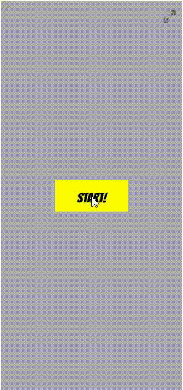

# animEngine. Motor JS para animar objetos en canvas HTML

## Descripción

Una aplicación experimental que permite animar objetos en canvas HTML. El motor actualmente tiene las funcionalidades básicas trasladar, rotar, escalar y transparencia. Su fin principal (pero escalable) es el de permitir animar historias interactivas en dispositivos móviles en formato vertical.

La aplicación esta desarrollada en javascript puro que modifica objetos en un elemento HTML canvas que se ajusta automáticamente a la altura o anchura de la pantalla manteniendo una relación 393x851.

Aunque no se han realizado pruebas exhaustivas, se ha observado de manera empírica que el motor tiende a alcanzar mejor performance en dispositivos que no cuentan con alta potencia en comparación con otras opciones en internet.

Aquí puedes explorar la [Demo funcional](https://jonnathan-cruz.000webhostapp.com/portfolio/lab/grammar/index.html).

Y aquí puedes ver [todo mi portafolio!!!](https://jonnathan-cruz.000webhostapp.com) -> Ready to Roll Out! 

## Instalación

Descargar y navegar al *index.html* de la raíz usando un apache para ello. Ejemplo de URL típica usando *XAMPP* y colocando el proyecto en la carpeta *hdocs*:
http://localhost/animEngine/index.html.

## Screenshots



## Pruebas

En el *index.html* se incluye el siguiente código, en el que a la función '*initialize*' se le pasa como parámetro el nombre del proyecto. Actualmente existen 2 proyectos: 'comic_1' y 'pj_1', que exploran todas las funcionalidades hasta ahora implementadas.

```javascript
window.onload = function(e){
	anim = new AnimEngine();
	anim.initialize("comic_1");
}
```

La carpeta */comic_1* contiene la estructura de archivos y carpetas estandar que requiere el motor.

```
- projects/
	- comic_1/
		- audio/
		- img/
		- comic_1.json
```

El archivo *comic_1.json* es el que contiene todos los *objects* con sus animaciones, disparadores y audios organizados en *scenes*. De notar que debe tener el mismo nombre de la carpeta con extensión *.json*.

Existen variedad de funcionalidades y disparadores que se entremezclan haciendo que el rango de combinaciones sea amplio; se listan a continuación con alguna clasificación que permita abarcarlas, se incluyen las funcionalidades planeadas pero no implementadas:

- Tipos de objeto (EnumObjectTypes):
    - IMAGE
    - RECT
    - TEXT *no implementado aún*
    - ARC *no implementado aún*
    - PATH *no implementado aún*
    - LINE *no implementado aún*
    - CIRCLE *no implementado aún*

- Tipos de animaciones (EnumAnimationsTypes):
    - MOVE
    - ROTATE
    - SCALE
    - ALPHA

- Subtipo de animación ROTATE (EnumAnimationsSubTypes):
	- ROTATION_TO_ANGLE
	- ROTATION_ANGLE_PER_SECOND

- Disparadores (EnumAnimationsTrigger):
	- ON_START_SCENE
	- ON_CLIC *no implementado aún*
	- ON_ANIMATION_START
	- ON_ANIMATION_FINISH

- Tipos de eventos OnClic (EnumClicEventTypes):
	- ON_CLIC_START_ANIMATION
	- ON_CLIC_PREVIEW_SCENE
	- ON_CLIC_NEXT_SCENE
	- ON_CLIC_GO_TO_SCENE *no implementado aún*
	- ON_CLIC_START_AUDIO
	- ON_CLIC_INI_FULL_SCREEN
	- ON_CLIC_END_FULL_SCREEN

- Tipos de disparadores de audio (EnumAudiosTrigger):
	- ON_START_SPECIFIC_SCENE
	- ON_CLIC *no implementado aún*
	- ON_AUDIO_START *no implementado aún*
	- ON_AUDIO_FINISH *no implementado aún*
	- ON_ANIMATION_START,
	- ON_ANIMATION_FINISH *no implementado aún*

## Créditos

### Assets:

- <a href="https://www.vecteezy.com/free-vector/hero">Hero Vectors by Vecteezy</a>

## TO-DO

- Implementar las funcionalidades pendientes que se tienen claramente identificadas.
- Incrementar la cantidad de objetos disponibles como círculos, líneas y formas.
- Aumentar la cantidad de animaciones posibles y mejorarlas, por ejemplo con efectos de transición como easy-in-out.
- Acualmente el archivo JSON debe escribirse a mano, pero debería construirse automáticamente con un editor de animación para este motor. Este editor sería de tipo drag-n-drop permitiendo la creación de las escenas, los objetos, animaciones, disparadores, audios y demás funcionalidades con su respectivo previsualizador.
- Podría mejorarse la relación ancho-alto, ya que actualmente es fija de 393x851 por simple tamaño promedio de dispositivos móbiles en el mercado. Idealmente podría hacerse adaptable, sin embargo habría que ajustar la forma en que el sistema realiza el cálculo de tamaño de cada objeto.
- Todas las animaciones ocurren en un canvas que es un elemento DOM dentro de un sitio web. Este sitio es básico pero podría estandarizarse y permitir personalización a nivel de colores, tipos de letra y demás, inclusive otro tipo de contenido adicional.
- El motor js podría optimizarse en su organización y reuso de código, así como mejores técnicas para solucionar situaciones, como la instanciación de objetos y llamado de sus operaciones.
- Correcciones requerida: Rotación al cambiar de ventana y volver puede aparecer con un valor inesperado.

## Licencia

Este código se distribuye bajo licencia GPLv3.


